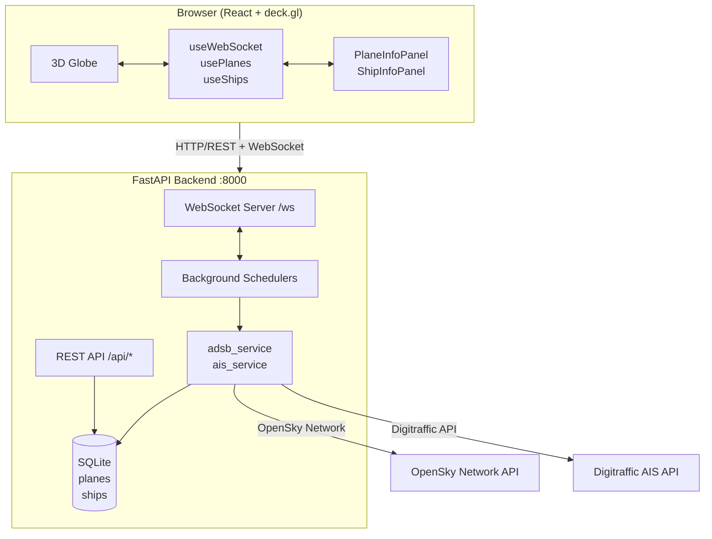
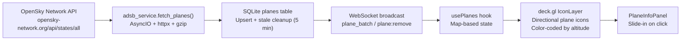
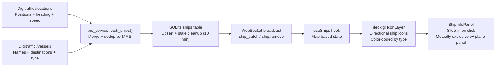

# TerraWatch

> Live Geospatial Intelligence Platform — planes, ships, and world events on a 3D globe


## What is TerraWatch?

TerraWatch is a real-time GEOINT (Geospatial Intelligence) platform inspired by Palantir. It visualizes global activity — aircraft, maritime vessels, and world events — on an interactive 3D globe that runs entirely in your browser.

**Core Features:**
- Real-time aircraft tracking via ADS-B (OpenSky Network)
- Real-time maritime vessel tracking via AIS (Digitraffic — Nordic/Baltic coverage)
- World event monitoring (GDELT) — *Phase 4*
- Conflict zone visualization (ACLED) — *Phase 4*
- Intelligence alerting — *Phase 6*

---

## System Architecture



## Data Flow — Planes (ADS-B)



## Data Flow — Ships (AIS)



---

## Current Status

| Phase | Name | Status |
|-------|------|--------|
| 1 | Foundation Setup | Complete |
| 2 | Live Aircraft Tracking | Complete |
| 3 | Live Ship Tracking | Complete |
| 4–7 | Events / Conflicts / Alerting | Planned |

### Phase 1 — Foundation Setup (Complete)

- FastAPI backend with WebSocket support
- React + deck.gl frontend with 3D globe
- Docker Compose orchestration with healthchecks
- REST API and WebSocket data pipeline

### Phase 2 — Live Aircraft Tracking (Complete)

- OpenSky Network API integration (~12,000 aircraft)
- Background scheduler (30s refresh)
- WebSocket broadcast to all connected clients
- Directional plane icons on globe, color-coded by altitude
- Click-to-inspect PlaneInfoPanel (callsign, altitude, speed, heading)
- Integration tests: 7/7 passing

### Phase 3 — Live Ship Tracking (Complete)

- Digitraffic AIS API integration (Nordic/Baltic coverage)
- Background scheduler (60s refresh)
- WebSocket broadcast for ship updates (batch + individual)
- Directional ship icons on globe, color-coded by type (cargo/tanker/passenger/fishing)
- Click-to-inspect ShipInfoPanel (name, MMSI, heading, speed, destination)
- PlaneInfoPanel and ShipInfoPanel are mutually exclusive
- Integration tests: 10/10 passing
- **Total backend test suite: 57/57 passing**

---

## How to Run

### Option 1 — Docker (Recommended)

**Prerequisites:** Docker + Docker Compose installed.

```bash
# Clone the repository
git clone https://github.com/RishiJain905/TerraWatch.git
cd TerraWatch

# Start both backend and frontend
cd docker
docker compose up --build

# Open in browser
open http://localhost:5173
```

Docker will:
- Build the backend Docker image and start it on port **8000**
- Build the frontend Docker image and start it on port **5173**
- Proxy `/api` and `/ws` requests from frontend to backend automatically
- Run a healthcheck against `GET /health` before marking backend ready

**Verify it works:**
```bash
# Backend health
curl http://localhost:8000/health

# Backend API — plane count
curl http://localhost:8000/api/planes/count

# Backend API — ship count
curl http://localhost:8000/api/ships/count

# All planes
curl http://localhost:8000/api/planes

# All ships
curl http://localhost:8000/api/ships
```

### Option 2 — Local Development

**Prerequisites:** Python 3.12+, Node.js 22+, npm.

#### Backend

```bash
cd backend

# Create virtual environment
python3 -m venv .venv
source .venv/bin/activate

# Install dependencies
pip install -r requirements.txt

# Start the API server (runs on port 8000)
python -m uvicorn app.main:app --reload --port 8000
```

#### Frontend (separate terminal)

```bash
cd frontend

# Install dependencies
npm install

# Start dev server (runs on port 5173, proxies /api and /ws to localhost:8000)
npm run dev
```

Then open **http://localhost:5173** in your browser.

> **Note:** The Vite dev server proxies `/api` → `http://localhost:8000` and `/ws` → `ws://localhost:8000` automatically. You do not need to configure anything manually.

### Vite Proxy Configuration

The frontend's `vite.config.js` handles cross-origin in development:

```javascript
server: {
  proxy: {
    '/api': { target: 'http://localhost:8000', changeOrigin: true },
    '/ws':  { target: 'ws://localhost:8000', ws: true },
  }
}
```

---

## Running Tests

```bash
cd backend
source .venv/bin/activate

# Run all tests
python -m pytest tests/ -v

# Run a specific test file
python -m pytest tests/test_ship_integration.py -v
python -m pytest tests/test_adsb_service.py -v
```

---

## Project Structure

```
TerraWatch/
├── backend/                     # FastAPI application
│   ├── app/
│   │   ├── main.py             # App entry, lifespan events, CORS
│   │   ├── config.py           # Environment config (ADSB_REFRESH_SECONDS, AIS_REFRESH_SECONDS)
│   │   ├── api/
│   │   │   ├── routes/
│   │   │   │   ├── planes.py   # GET /api/planes, /api/planes/count, /api/planes/{icao24}
│   │   │   │   └── ships.py    # GET /api/ships, /api/ships/count, /api/ships/{mmsi}
│   │   │   └── websocket.py     # WebSocket /ws — broadcast_plane_batch/ship_batch
│   │   ├── core/
│   │   │   ├── database.py     # SQLite init, upsert/delete helpers, db_write_guard
│   │   │   └── models.py        # Pydantic models: Plane, Ship, WSMessage
│   │   ├── services/
│   │   │   ├── adsb_service.py  # OpenSky Network fetch + normalize
│   │   │   └── ais_service.py   # Digitraffic AIS fetch + merge by MMSI
│   │   └── tasks/
│   │       └── schedulers.py    # asyncio scheduler loops for planes + ships
│   ├── requirements.txt
│   └── Dockerfile
│
├── frontend/                    # React 18 application
│   ├── src/
│   │   ├── App.jsx             # Root — selectedPlane/selectedShip state, mutual exclusion
│   │   ├── components/
│   │   │   ├── Globe/
│   │   │   │   ├── Globe.jsx   # deck.gl GlobeView + IconLayer (planes + ships)
│   │   │   │   └── Globe.css   # Legend, info bar
│   │   │   ├── PlaneInfoPanel/ # Slide-in panel for plane details
│   │   │   └── ShipInfoPanel/  # Slide-in panel for ship details
│   │   ├── hooks/
│   │   │   ├── useWebSocket.js # WS connection, heartbeat, reconnect
│   │   │   ├── usePlanes.js    # Plane state + WS plane_batch handling
│   │   │   └── useShips.js     # Ship state + WS ship_batch handling
│   │   └── utils/
│   │       ├── planeIcons.js   # Directional SVG plane icons (cached atlas)
│   │       └── shipIcons.js    # Directional SVG ship icons (type-colored)
│   ├── package.json
│   ├── vite.config.js           # Vite + React plugin + /api + /ws proxy
│   └── Dockerfile
│
├── docker/
│   └── docker-compose.yml       # Backend + Frontend services, healthchecks
│
├── docs/                        # Architecture docs + phase completion summaries
│   ├── ARCHITECTURE.md
│   ├── DATA_SOURCES.md
│   ├── API.md
│   └── docs/completedphases/
│       ├── phase2/
│       └── phase3/
│
├── docs/completedphases/                      # Agent task specifications
│   ├── phase2/
│   └── phase3/
│
└── README.md
```

---

## Tech Stack

| Layer | Technology | Notes |
|-------|------------|-------|
| Frontend | React 18 + Vite | Fast HMR, ESBuild |
| Globe | deck.gl `GlobeView` | WebGL, renders 10,000+ points |
| Map Tile | Mapbox GL JS | `maplibre-gl` for tiles |
| Backend | Python FastAPI | Async-native, auto OpenAPI docs |
| Database | SQLite | File-based, zero config |
| Real-time | FastAPI WebSockets | Native, no extra deps |
| HTTP Client | `httpx` (async) | Handles gzip decompression |
| Containers | Docker + Docker Compose | One-command startup |

---

## Development

### Agent Workflow

TerraWatch is built by a multi-agent system:

| Agent | Role | Responsibilities |
|-------|------|-----------------|
| **MiniMax M2.7** | Coordinator | Architecture, Docker, integration, PRs |
| **GPT 5.4** | Backend | FastAPI routes, data services, schedulers, database |
| **GLM 5.1** | Frontend | React, deck.gl layers, globe, info panels |

Task files in `docs/completedphases/phaseX/` define implementation work for each agent. Agents read the task spec, implement the code, then document completion in the same file.

### Version Roadmap

| Version | Phases | Features |
|---------|--------|---------|
| **V1** | 1–3 | Live planes + ships on globe *(current)* |
| **V2** | 4–5 | GDELT world events + ACLED conflict heatmap |
| **V3** | 6–7 | Zone alerting + production hardening |

---

## API Reference

### REST Endpoints

| Method | Path | Description |
|--------|------|-------------|
| `GET` | `/` | API info + version |
| `GET` | `/health` | Health check → `{"status":"healthy"}` |
| `GET` | `/api/planes` | All active planes (stale removed) |
| `GET` | `/api/planes/count` | Plane count → `{"count": N}` |
| `GET` | `/api/planes/{icao24}` | Single plane or `null` |
| `GET` | `/api/ships` | All active ships (stale removed) |
| `GET` | `/api/ships/count` | Ship count → `{"count": N}` |
| `GET` | `/api/ships/{mmsi}` | Single ship or `null` |

### WebSocket — `/ws`

Connect via `new WebSocket('ws://localhost:8000/ws')`.

**Server → Client messages:**

| Type | Action | Description |
|------|--------|-------------|
| `plane` | `upsert` / `remove` | Single plane update |
| `plane_batch` | `upsert` | All planes in one message |
| `ship` | `upsert` / `remove` | Single ship update |
| `ship_batch` | `upsert` | All ships in one message |
| `heartbeat` | — | Sent every 10s to keep connection alive |

Example ship_batch message:
```json
{
  "type": "ship_batch",
  "action": "upsert",
  "data": [{ "id": "219598000", "lat": 55.77, "lon": 20.85, "heading": 79, "speed": 0.1, "name": "NORD SUPERIOR", "destination": "NL AMS", "ship_type": "tanker", "timestamp": "..." }],
  "timestamp": "2026-04-11T05:00:00Z"
}
```

---

## Data Sources

| Source | Type | Coverage | Auth | Refresh |
|--------|------|----------|------|---------|
| [OpenSky Network](https://opensky-network.org/api/states/all) | Aircraft (ADS-B) | Global (~12,000 aircraft) | None | 30s |
| [Digitraffic AIS](https://meri.digitraffic.fi/api/ais/v1/) | Ships (AIS) | Nordic/Baltic (~1,000–2,000 ships) | None | 60s |
| [GDELT Project](https://www.gdeltproject.org/) | World Events | Global | None | 15 min |
| [ACLED](https://acleddata.com/) | Conflicts | Global | Free registration | Daily |

Digitraffic requires `Accept-Encoding: gzip` header. The backend handles this automatically.

---

## Documentation

- [Architecture](docs/ARCHITECTURE.md) — System design, data models, version plan
- [Data Sources](docs/DATA_SOURCES.md) — API details, response formats, field mappings
- [API Reference](docs/API.md) — Full REST + WebSocket API docs
- [Deployment Guide](docs/DEPLOYMENT.md) — Docker, production, environment variables

---

## License

MIT — see [LICENSE](LICENSE) for details.
