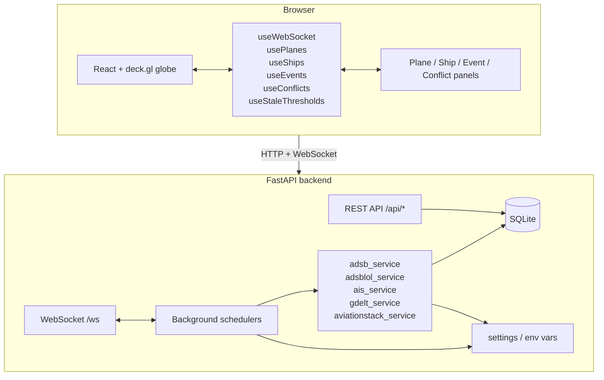
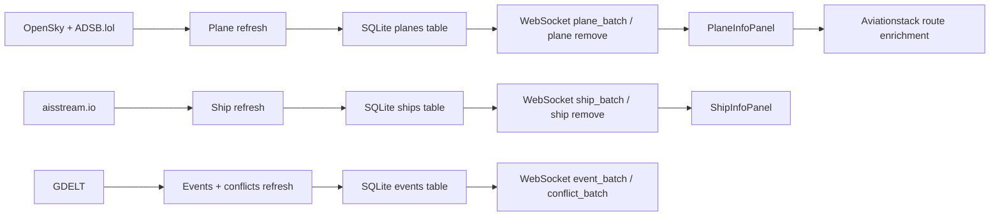

# TerraWatch Architecture

## Overview

TerraWatch is a real-time GEOINT platform that visualizes aircraft, ships, world events, and conflict activity on an interactive globe.

The current branch adds:
- Selected-plane route enrichment via Aviationstack
- Solar terminator raster, starfield, polar caps, and atmosphere
- Map style switching, minimap, keyboard shortcuts, and globe controls
- Plane and ship trail overlays
- Backend stale-threshold configuration exposed through `/api/stale-thresholds`

## Runtime Model

## Main Data Flows

## Backend Modules

- `backend/app/main.py` wires routers, CORS, and app lifecycle hooks.
- `backend/app/config.py` loads environment variables, stale thresholds, and route cache settings.
- `backend/app/core/database.py` owns SQLite initialization, migrations, upserts, and stale cleanup.
- `backend/app/tasks/schedulers.py` refreshes planes, ships, and events on intervals.
- `backend/app/services/aviationstack_service.py` enriches selected planes with route data.
- `backend/app/services/adsblol_service.py` augments ADS-B plane coverage with the public point API.

## Frontend Modules

- `frontend/src/components/Globe/Globe.jsx` renders the globe, overlays, and selection state.
- `frontend/src/components/Globe/MapStyleSwitcher.jsx` switches basemap styles.
- `frontend/src/components/Globe/Minimap.jsx` renders the inset overview map.
- `frontend/src/components/Globe/planeTrail.js`, `routeOverlay.js`, and `shipTrail.js` build trail geometry.
- `frontend/src/utils/terminator.js` builds the procedural night-side raster.
- `frontend/src/utils/formatters.js` centralizes display formatting and clipboard fallback behavior.

## Data Model

- `planes` stores active aircraft with position, speed, altitude, heading, callsign, squawk, and timestamp.
- `ships` stores active vessels with position, heading, speed, name, destination, ship type, and timestamp.
- `events` stores GDELT world events and conflict events.
- `conflicts` are derived from `events` rows whose category is in the violent-event set.

## Operational Notes

- The frontend uses `VITE_API_URL` and `VITE_WS_URL` when set.
- In local development, the frontend can talk directly to the backend or through the Vite proxy.
- The backend exposes stale-threshold values through `/api/stale-thresholds` so the frontend can stay in sync with cleanup behavior.
